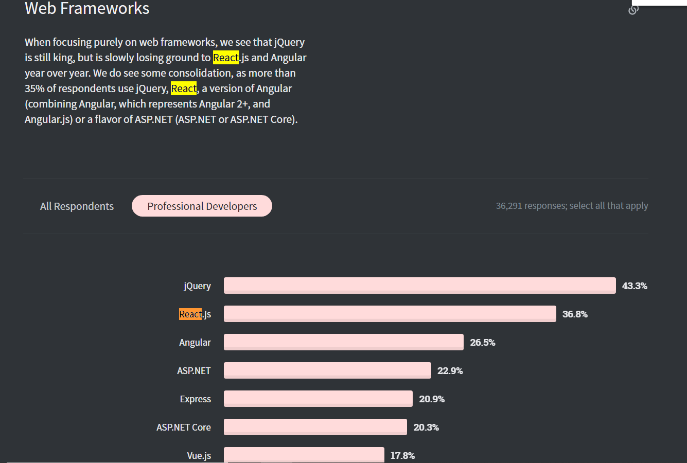
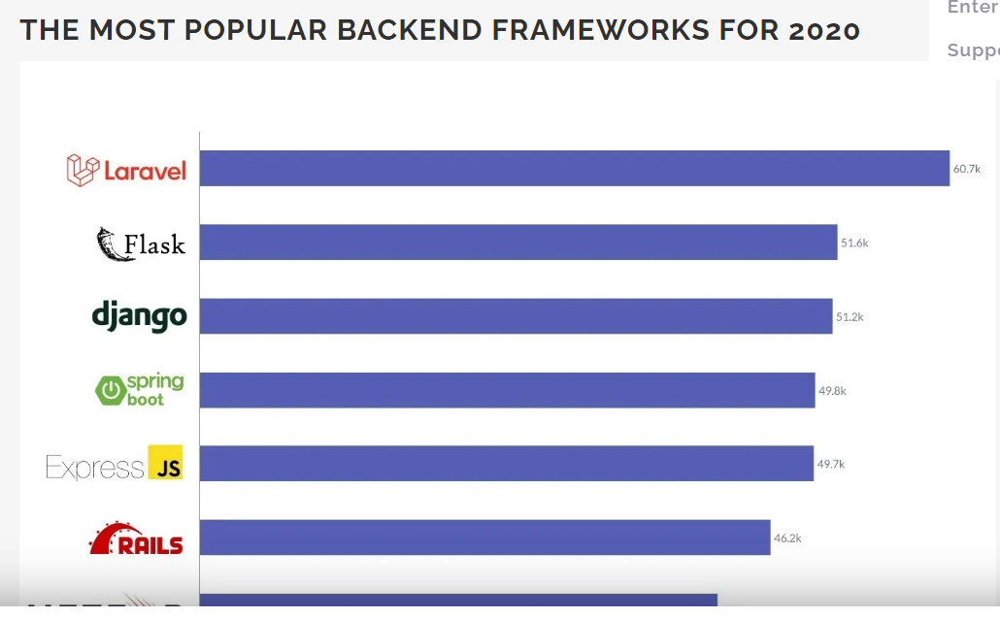
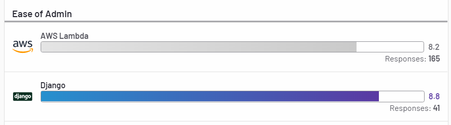
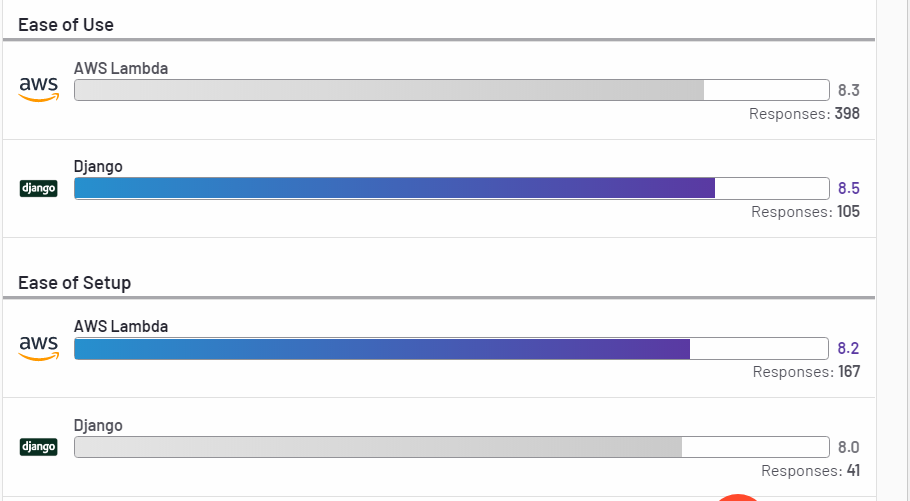
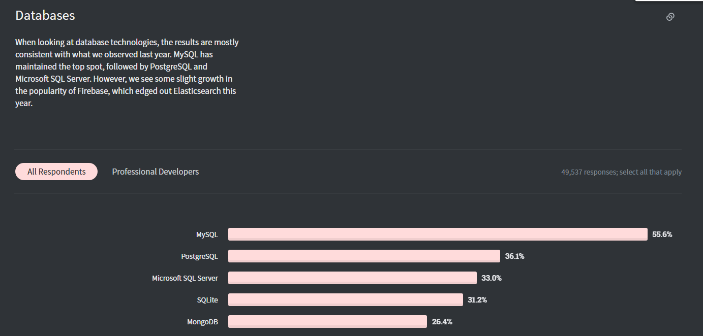
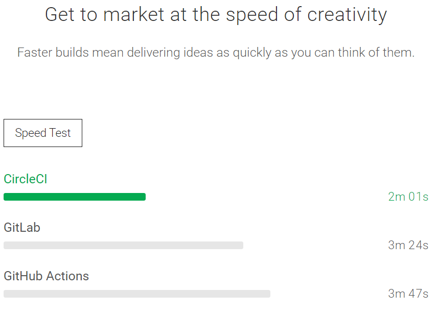
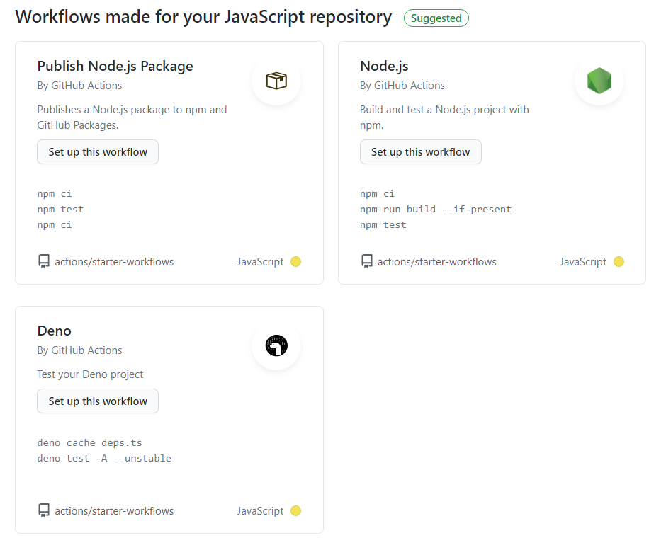

# Checkout Cart

This is the code repository for CSC301 2021 Winter Assignment 1.

In this assignment, we implement a Game Shop website with a simple checkout cart. 

## Author

- Jefferson Zhong
- Qi Zhu

## Production website

http://csc301a1.s3-website.ca-central-1.amazonaws.com/

## Table of Contents

- [Checkout Cart](#checkout-cart)
  - [Author](#author)
  - [Production website](#production-website)
  - [Table of Contents](#table-of-contents)
  - [Design and Architecture](#design-and-architecture)
  - [Design and Comparisons](#design-and-comparisons)
    - [Platform: Web](#platform-web)
    - [Frontend](#frontend)
      - [Comparison with other frontend technology](#comparison-with-other-frontend-technology)
      - [Vue vs React](#vue-vs-react)
      - [Angular vs React](#angular-vs-react)
      - [Summary](#summary)
    - [Backend:](#backend)
      - [Comparison with other backend technology](#comparison-with-other-backend-technology)
      - [Why Lambda](#why-lambda)
      - [Why Serverless](#why-serverless)
    - [Database](#database)
      - [Comparison with other database](#comparison-with-other-database)
      - [Why DynamoDB](#why-dynamodb)
      - [Why Eventual Consistency](#why-eventual-consistency)
    - [Website Deployment](#website-deployment)
    - [CI/CD: GitHub Actions](#cicd-github-actions)
      - [Comparison with other CI/CD tools](#comparison-with-other-cicd-tools)
      - [CircleCI vs  GitHub Actions](#circleci-vs--github-actions)
      - [Jenkins vs GitHub Actions](#jenkins-vs-github-actions)
      - [Summary](#summary-1)
  - [Available Scripts](#available-scripts)
    - [`npm start`](#npm-start)
    - [`npm test`](#npm-test)
    - [`npm run build`](#npm-run-build)
    - [`npm run eject`](#npm-run-eject)

## Design and Architecture

- **Platform**: Web Application
  - deployed to AWS S3
- **Frontend**: ReactJS
  - responsive
- **Backend**: Node.js on AWS Lambda
  - Lambda: carts
    - get request: get the cart in *carts* table with corresponding cartId
    - put request: put/update the cart in *carts* table with corresponding cartId
  - Lambda: items
    - get request: return all items stored in *items* table
- **Database**: DynamoDB
  - items
    - itemId: string
    - name: string
    - price: number
    - image: string
  - cart
    - cartId: string
    - items: [{itemId: string, count: Number}...]
- **CI/CD**: GitHub Actions
  - Continuous Integration: on pull request or push to dev branch, do build and test.
  - Continuous Deployment: on pull request or push to main branch, do build, test, then deploy to S3.

## Design and Comparisons

Careful considerations are made before selecting our tech stack. In the following sections, we present detailed comparisons with alternative technologies available and the reasons why we adopted the current stack.

### Platform: Web
In this assignment, we are given the choice between mobile and web application. We choose to develop a web application because of cross-platform and accessibility:

- **cross-platform**: Without learning new cross-platform frameworks such as React Native, dev eloping sole mobile application will restrict us to the OS environment.
- **accessibility**: Web application can be accessed anywhere with internet, which do not require software installation and special device.

### Frontend
For frontend, we choose to use React because of its maturity of ecosystem and ease-of-development. 

#### Comparison with other frontend technology
We'll mainly compare these three Frontend options : React,Vue and Angular.
- **Popularity: Widespread Usage**
  
  - According to StackOverflow 2020,React.js is the second most popular web framework among all, as more then 35% of respondents use React.js.
  - Compared to React.js, other famous frameworks such as Angular.js, Vue.js,Spring has less users.
 
  
    | Web Framework | Popularity (collected from Stackoverflow 2020 suryvey) |
    | ------------- | ------------------------------------------------------ |
    | React.js      | 35.9%                                                  |
    | Angular       | 25.1%                                                  |
    | Vue.js        | 17.3%                                                  |
    | Spring.js     | 16.4%                                                  |

#### Vue vs React

- **Domain Covered**
  -  React and Vue are  terrific framework that can be applied on both frondend and backend.

- **Ease of Development**
  - Although with clearer documentation and easy learning curve, Vue is easy for beginner to learn. It's also easier to get accustomed to because it picked out the advantages of React and Angular. 
  - However, both my teammates and I are more familiar with React. Working with technology that we are familiar would be helpful for debugging and implementation.
- **Maturity: React has broader package ecosystem**
  - Vue has fewer resources, available packages and third-party libraries. 
  - Both Vue and React gain support from all major IDEs, while React is more extensive.
  - React features a huge ecosystem and an extremely active community, which is convenient. That is to say, it contains a huge amount of libraries, packages,tools. That is to say, we may easy find a solution or an extra package to fix the problem we encounter.
- **Scalability: Reusing Component in React**
  - React is more scalable since it uses JSX which allows reusing component in the code. Thus the code structure is neat and clean. Both HTML and CSS are expressed via JavaScript with XML syntax.
  - Vue uses HTML templating with single file component. When we are develop large project, reusing HTML templates is a huge pain and is nasty.
- **Performance**
    - **Rendering Child Component In React**
      - Vue prevents unnecessary renders of child components by tracking dependencies.
      - While in React, if a component state is modified, then all the child components of this parent component will be re-rendered. This will cause some lag in running speed.
    - **Vue Has built-in Server Side Rendering**
      - React needs third-party libraries assistance to implement server side rendering. However, Vue has in-built Server side rendering capabilities which is much convenient.
#### Angular vs React

- **Domain Covered**
  -  React and Angular are both suitable for web and mobile development. And they both require additional framework for mobile development, which are React Native and NativeScript respectively. And they both support single-page and multiple-page web applications. They are well-matched in domain covered.
- **Ease of Development**
  -  React is more easy to learn and angular are new to us.
  - With basic knowledge, the framework of React is much simple to understand. React is minimalistic, which do not have complicated features and dependency injection.
  - Angular possess a huge library and it uses TypeScript and it's constantly updated. The syntax and component management is also intricate, thus Angular requires extra learning effort.
- **Language**
  - Angular support both JavaScript and TypeScript. TypeScript is more compact than JavaScript which is easier for code refactoring and debugging.
  - React used JSX script and it helps JavaScript resemble the code written in HTML. It makes the code more readable and allowing reuse of component. 
- **Performance**
  -  Angular has worse performance. when developing complex and dynamic web applications. This is mainly caused by bidirectional data-binding with assigned watchers.
  -  Angular also uses regular DOM. it generally re-rendering the whole page which is a heavy DOM manipulation.
  -  React performs better with the feature of light weight virtual DOM and thus it only updates those changed object,which further saves time and resources.

- **Structure of the Application**
  - Angular has fixed and complex structure and is applying an MVC structure: Model, Controller, and View, which is more suitable for developer with experience.
  - React does not restrict the developer on structures and it only offers only View Layer. Since we are building a simple single-page website, React is enough for us.
- **Dependency Injection: not supported in React**
    - Angular supports dependency injection and further allows having different lifecycles for different stores
    - React does not support dependency injection. It only has a global state for all components. 

#### Summary
As the most popular frontend technology, React requires less learning effort and has better performance with the Virtual DOM. Compared the other two tools with similar features, React is more manageable and has better performance. Thus, we choose React as our Frontend technology.

### Backend:

Our backend is serverless deployed on AWS Lambda.

#### Comparison with other backend technology
We'll mainly compare three backend techonology: AWS Lambda, Flask and Django
- **Language supported**
  - Both Django and flask are python web framework , AWS Lambda supports Java, Go, PowerShell, Node.js, C#, Python, and Ruby code. It allow us to write functions in any programming language, which is extremely convenient.
- **Popularity**
  -   According to the ranking,flask and Django are both one of the top3 popular backend framework for 2020.
  
  - However, AWS is now one of the top cloud computing platform taking over 32.4% of the market share and according to the research, 50% of the AWS users is in use of AWS lambda.With an infrastructure footprint in AWS, AWS lambda are widely use across a variety of companies.
  - **AWS vs Django:Ease of Setup and quality delivered**
    - According to a online research comparing pros and cons of AWS and Django:
    - AWS lamda is preferred with the ease of set up and quality of support. While Django wins with
    administrative use.
      
    - 
  - **Pros and Cons of Django**
    -   Django focuses on delivering business value of the product, which is favor by larger companies.
    - It's built-in ORM(objeect relational mapping ) and template system is also a large advantage.
    - Since we are only developing small projects, Django is quite of a advanced framework to us. Thus we don't use it.
  - **Pros and cons of Flask**
    - Flask features a lightweight and modular design.Though we need additional extensions to transform it to the web framework.
    - It has extensive documentation and thorough unit testatbility in the application.
    - Cons:Flask handle every requst in turn since it has singular source. Thus, it takes a lot of time when processing multiple request.
#### Why Lambda
We decided to use AWS Lambda for its scalability, maturity and ease of development. Lambda automatically scales to handle 1,000 concurrent executions per Region, a quota that can be increased if needed. Some well known competitors to AWS Lambda are Microsoft's Azure function and Google function. Azure function only supports *C#* , *F#*, and *Shell* scripting, while Google Function only supports *JavaScript* and is the most expensive one out of the three listed. The two counterpart to AWS Lambda are not as mature as AWS Lambda. AWS Lambda is the first commercial serverless platform offered by a large cloud vendor, and it is still the most widely used serverless platform. Furthermore, one of our team member has previous experience in using AWS Lambda.  Therefore Lambda is the best option for us.
#### Why Serverless
Major concern that lead to a serverless backend are scalability and cost efficiency. Our application is monolithic for which contains only a few interactions with database and can be easily made stateless. Once the backend becomes stateless, the serverless backend hosting platform can start as many copies of the function as needed. When the function receives a request while it's processing a previous request, another instance of the function could be launched to handle the increased load.

Another consideration is on website deployment. Many website hosting platforms such as S3 and GitHub Pages only accepts static website hosting and would not execute any backend code other than serverless ones. If our backend is not serverless, then compute machines such as AWS EC2 must be rented to deploy our dynamic website. Comparing to serverless backend that is paid-per-use, rental of a compute machine could be much less cost-efficient. 

### Database

Our database is AWS DynamoDB running on eventual consistency.
#### Comparison with other database
We mainly compare three database in this section: MongoDb, DynamoDB,MySQL.

- **Popularity**
  - According to the stackover flow 2020 survey, mysql is ranked as the top one database tenology , while  mongoDB is at the 5th place. 
  - While for DynamoDb, as it's one of the associated service in AWS, it's also popular around developers.
- **Ease of Development**
  - As an integrated AWS service, DynamoDb is easier to develop end to end solution.
  - Compared to MongoDB which use JSON-like documents,DynamoDB uses tables,items and attributes. Thus DynamoDB is easier to develop for beginner that is new to database.

- **MySQL Pros and cons**
  - MySQl is considered an open-source database option and it's icnredibly inexpensive compared to the other two database.
    - **Cons:Scaling**
      - When dealing with large scale operations at a given time, MySQL has poorer performance
- **MongoDB pros and cons**
  - **Speed**
    - MongoDb has quicker query performance, since it stores thee majority of the data in RAM.
  - **Support more type**
    - As both NoSQL database,  MongoDb supports more datatypes than DynamoDB, and has less restriction on size.
  - **Not support Transaction**
    - MongoDb does not support for trnasaction, it only support certain atomic operations.

More detailed Comparison are listed in "Why DynamoDb".

#### Why DynamoDB
We choose DynamoDB on considerations toward scalability and fault tolerance. DynamoDB automatically spreads the data and traffic for tables over a sufficient number of servers to handle the throughput and storage requirements, while maintaining its consistency level and achieving fast performance. All of the data is stored on solid-state disks (SSDs) and is automatically replicated across at least two Availability Zones in an AWS Region, providing built-in high availability and data durability.

#### Why Eventual Consistency

Eventual consistency reduces read/write latency by sacrificing synchronization. It is possible that the data read are stale. However, since our application only read the cart and items at website launch, the synchronization sacrifice is acceptable. Therefore, for better latency, we choose eventual consistency.     

### Website Deployment

We decided to use AWS S3 mainly for availability and performance. The following graphs demonstrates that S3 out performs its competitors in both latency.

*Image credit: https://www.jeremymorgan.com/blog/programming/how-fast-are-github-pages/*

S3 is indeed a distributed cloud storage for which can be configured to distribute among multiple regions for greater availability and less latency.

Additionally, we already have our backend and database on AWS, for better tooling integration, we should use S3.  

### CI/CD: GitHub Actions

We use GitHub Actions as our CI/CD tools in this assignment.
#### Comparison with other CI/CD tools
We'll mainly compare these three CI/CD tools options : CircleCI, GitHub Actions, Jenkins.
- **Popularity**
  - Both CircleCI and Jenkins are ranked as one of the best CI/CD tools in 2020. Among which, Jenkins is ranked as the top 1 best CI/CD tools in 2020. As one of the latest CI/CD tools, GitHub Actions are not in the list.
- **Ease of Development**
  - GitHub Actions is the most convenient one among all three options. Since we are using GitHub as our source control platform, it house our code repository and pipeline under the same platform. 
  - For the other 2 CI/CD tools, they both need installation and the setting up process is much more inconvenient.

#### CircleCI vs  GitHub Actions
  - **Performance: Faster building speed in CircleCI**
    - According to the speed test comparison of different CI/CD tools, CircleCI has the fastest building speed among all. While GitHub Actions is only in the 3rd place.
      
  - **Community Powered Shared Actions**
    - GitHub Actions support shared actions which is really convenient for beginners. The published actions can be reused by others. They also automatically detect the language you are using in the repo and provide workflow suggestion and corresponding template.
     
  - **Feature: Allowing Multiple config**
    - GitHub Actions are able to configure multiple files compared to CircleCI. Although CircleCI also use YAML , it expect only one config file in each repository.
  - **Cons: Limit build history and less feature in GitHub Action**
    - GitHub Actions only showed the build for a week before deleting the build log.
    - While CircleCI track analytical data on all of the jobs. CircleCI also introduced more built-in features such as Manual approval/trigger.
#### Jenkins vs GitHub Actions
  - **Scripts: Clearer Structure and intuitive scripts**
    - Compared to Jenkins, GitHub Actions uses *yaml* to create workflows and configuration files, which has clearer structure .especially when building with multiple operating system. Jenkins uses declarative pipeline and scripted pipelines.
      
- **Hosting: Cloud hosting in GitHub Actions**
  - GitHub Actions hosts its own runner in the cloud for us to use to run jobs, while Jenkins deployment are mostly self-hosted. As user, we need to maintain the server in our own data centers, which is much more inconvenient than GitHub actions
- **Performance: Jenkins requires more time to run**
  - Jenkins use sequential pipeline while GitHub Actions follow the coordinator and build nodes pattern.
  - With GitHub Actions,multiple actions components work together to run jobs, which is much more efficient.
  - With Jenkins,each step are executed in the deployment pipeline synchronously, which would caused more time for execution.
- **Domain Covered**
  - Jenkins can handle many types of jobs including bash scripts, maven, PowerShell. 
  - GitHub Actions do not cater for ad hoc jobs. It listening to git events. However, since we are only dealing with git events in this assignment, GitHub Actions is sufficient for us.
#### Summary
All in all, despite some defects in limited domain and popularity,since we are designing a small project and use GitHub as our source platform, GitHub Actions still wins with its ease of development and good performance.

## Available Scripts

In the project directory, you can `cd checkout-cart` and run:

### `npm start`

Runs the app in the development mode.

### `npm test`

Runs testing for backend (serverless on lambda and dynamo).

### `npm run build`

Builds the app for production to the `build` folder.\
It correctly bundles React in production mode and optimizes the build for the best performance.

The build is minified and the filenames include the hashes.\
Your app is ready to be deployed!

See the section about [deployment](https://facebook.github.io/create-react-app/docs/deployment) for more information.

### `npm run eject`

**Note: this is a one-way operation. Once you `eject`, you can’t go back!**

If you aren’t satisfied with the build tool and configuration choices, you can `eject` at any time. This command will remove the single build dependency from your project.

Instead, it will copy all the configuration files and the transitive dependencies (webpack, Babel, ESLint, etc) right into your project so you have full control over them. All of the commands except `eject` will still work, but they will point to the copied scripts so you can tweak them. At this point you’re on your own.

You don’t have to ever use `eject`. The curated feature set is suitable for small and middle deployments, and you shouldn’t feel obligated to use this feature. However we understand that this tool wouldn’t be useful if you couldn’t customize it when you are ready for it.
